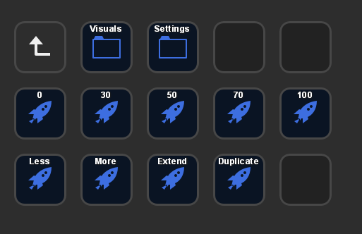
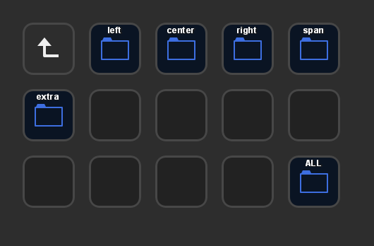
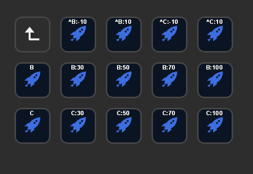
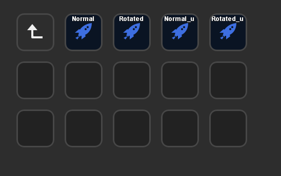

# Example: Dynamic Button Generation on StreamDeck

The python module implements the logic to dynamically generate streamdeck buttons.
This example demonstrates how useful this is for something like monitor controls (brightness/contrast/orientation/etc).

The code defines a `Buttons`, `MonitorLayout`, and `MonitorManagerHelper` class to implement the logic.
The utilities like `tools`, `config`, `Games` are not currently available, so this example only shows how the buttons are generated but the actual monitor control implementation is a WIP.

## Example
The top-level layout has settings to change all monitor brightness/contrast to the values 0, 30, 50, 70, and 100. There is also More/Less for changing screen intensity relatively, and extend/duplicate. The `MonitorManagerHelper` class uses the `@register` decorator to define all these controls.

When we click on the Visuals folder, we see that there are folders for each monitor that were dynamically generated. 

Inside a given monitor, there are all the brightness and contrast controls you could need:
This is what `MonitorLayout.create_screen_controls()` does.

If we went to `Settings` instead of `Visuals`, we get to control the orientation.
This is what `MonitorLayout.create_setting_controls()` does.

## Conclusion

In conclusion, advanced usage of the python decorators offered by Pybiosis make it possible to have fully customized and dynamic layouts.
With this code, I can manage all my monitors so easily, in the morning one click to set the brightness, if its too dark, if I want to play a game, plug in another device, etc., I can do it all from the streamdeck now and within python.

The dynamic button generation means that monitors are determined at compile time. If you recompile the buttons with a different monitor setup, the button layout will adapt. This is because Python can be used to determine which monitors exist, and Pybiosis can attach streamdeck buttons to them during compilation. Then, the buttons are linked to the python functions.

Furthermore, you can create and add higher-level functions for something like a layout (eg: left monitor landscape, ...).
For example, I use NVIDIA Surround, which doesn't seem to support any API, and so it must be done through the interface. 
Instead, I can write a python function that uses `pyautogui` to carry that out, further streamlining tedious or common workflows.
